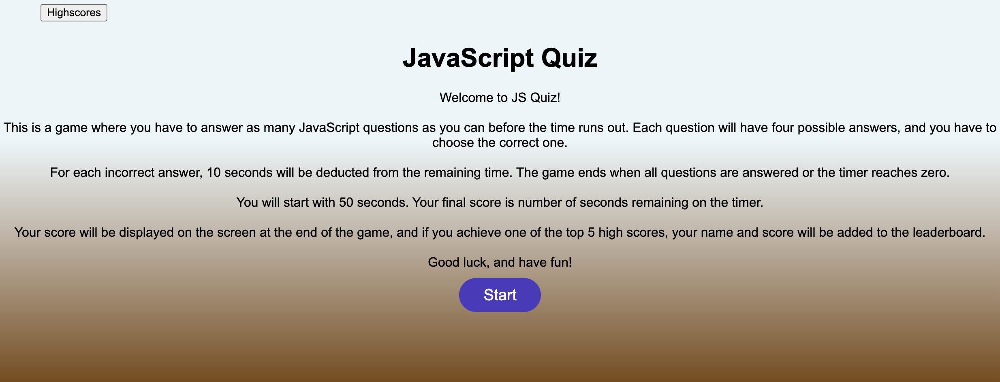

# JavaScript Quiz

This is a simple quiz app built with HTML, CSS, and JavaScript. The user is presented with a series of multiple-choice questions and must choose one of the provided options. Once the quiz is completed, the user can submit their score and view the highscores.

## Usage

To use this app, simply open the `index.html` file in a web browser. The quiz will begin automatically and the user will be presented with the first question. They can choose an answer by clicking on one of the provided options. After each answer, the app will display whether the user was correct or not and move on to the next question. 

Once the user completes the quiz, they will be prompted to enter their initials and submit their score. The app will then display the highscores, which can be viewed by clicking the "Highscores" button in the header.

## Customization

This app can be easily customized by modifying the `questions` array in the `script.js` file. Each question in the array is an object with the following properties:

- `question` (string): The question prompt
- `options` (array of strings): The answer options
- `answer` (number): The index of the correct answer (0-indexed)

The app can also be customized by modifying the CSS styles in the `style.css` file.

## License

This project is licensed under the MIT license. See the `LICENSE` file for more details.

### Screenshot

### Link to deployed website
[Website Link](https://riskthatbiscuit.github.io/JavaScriptQuiz/)